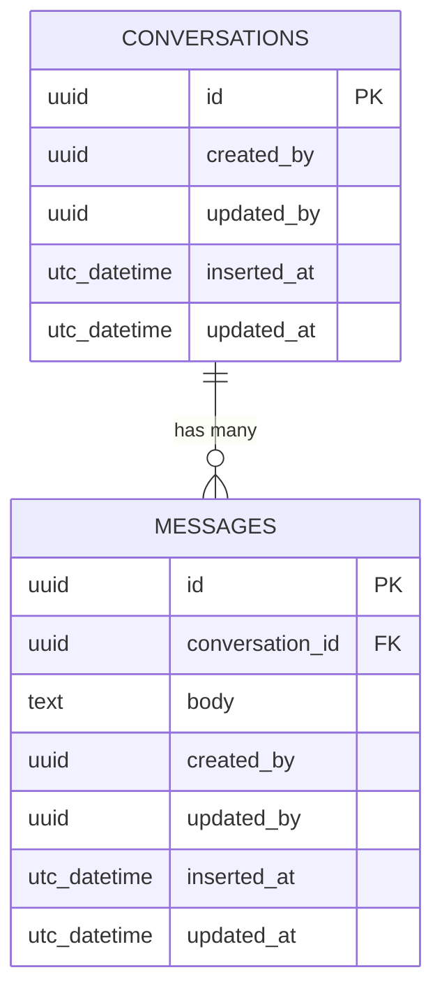

# SS-ChatService

`SS-ChatService` is a highly concurrent, low-latency microservice built for the SamStore ecosystem using Elixir and the Phoenix Framework. It orchestrates real-time WebSocket communication and messaging history using an N-Layer architectural paradigm.

## 🚀 Tech Stack
- **Language**: Elixir v1.19.5 (Erlang/OTP 28)
- **Framework**: Phoenix v1.8.7 (Headless API `no-html` / `no-assets`)
- **Database**: PostgreSQL (Ecto ORM)
- **Server**: Bandit

## 🛠️ Architecture
The service strictly adheres to the **N-Layer Separation of Concerns**:
- `lib/ss_chat_service_web/`: **Web Layer**. Only handles HTTP connections, Routing, Parameter Validations, and JSON/WebSocket Views.
- `lib/ss_chat_service/`: **Business Logic Layer (Contexts)**. Encapsulates all transactional core operations. The Controller passes validated payload structs to contexts (e.g. `Chat`).

## 📊 Database (ERD)
The current schemas utilize `UUID` heavily and implement native audit logging patterns.

## ⚙️ Getting Started

To start your Phoenix server:

1. Setup the Database Config in `config/dev.exs` with standard Postgres `username/password` (`postgres/postgres`). Database name by default points to `ss_chat_db`.
2. Run `mix setup` to install and setup dependencies.
3. Create and migrate your database with `mix ecto.setup`.
4. Start Phoenix endpoint with `mix phx.server` or inside IEx with `iex -S mix phx.server`.

Now you can visit [`localhost:4000`](http://localhost:4000) from your browser.
